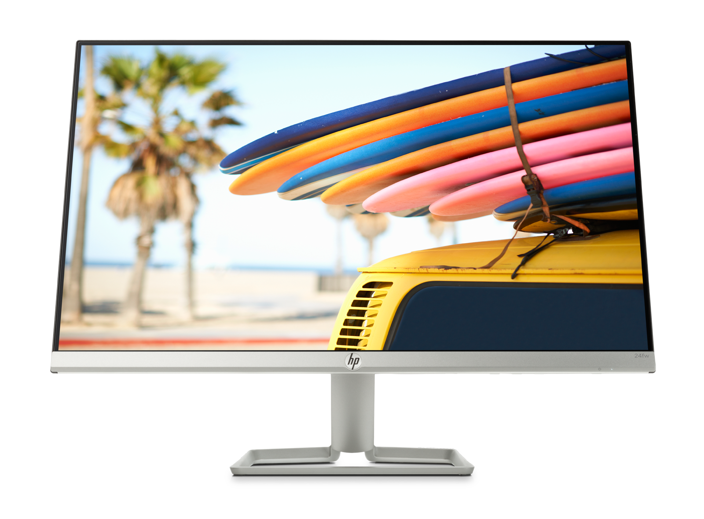

## Monitores

Los monitores son un tipo de **dispositivos electrónicos de salida** en la computadora en el que se muestran **las imagenes y textos procesadas por medio de un adaptador grafico** o de video. Normalmente, el término monitor se refiere a la pantalla de vídeo cuya función única y principal es permitir al usuario interactuar con la computadora por medío de los textos e imagenes procesados anteriormente, *usando datos*.

### Historia del monitor
* **El creador del monitor fue William Crookes** en el año 1878.
* El primer ordenador con capacidad de llamarse como tal fue creado en el año 1936 y su creador fue Honrad Zuse, por consiguiente, era **el inicio del monitor de computadora o monitores para pc**.
* En la decada de los 70, **empezó la movida de los monitores CRT (Que eran monocromaticos)** y su respectivo adaprador MDA.
* En los años 80, habían distintas variaciones de los adaptadores que **permitian mejor soporte para colores, mejor resolucion y, junto a ello**, habían **mejores tarjetas graficas** que se adaptaban a estos.
* En los años 90, y la movida de los **monitores CRT, se crearon los Monitores LCD**, con una pantalla de cristal liquido con **un numero de pixeles en colores puestos delante de una luz**, siendo muy superior a su predecesor.
* En la epoca actual, se han creado distintas variaciones de los Monitores LCD **como los Monitores Plasma.**