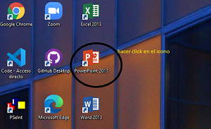

# COMO CREAR UNA PRESENTACION EN POWER POINT
### ABRIR POWERPOINT

### SELECCIONE PLANTILLA/TEMA QUE DESEE UTILIZAR

+ luego de seleccionar la plantilla 
+ hacer click en crear

### INSERTAR CUADRO DE TEXTO

+ en la parte superior "insertar cuadro de texto"

#### Editar texto
+ escoger fuente 
+ tamaño de fuente 
+ centrar,alinear a la izquierda o derecha

### INSERTAR IMAGENES
+ hacer click en insertar

+ hacer click en "imagenes"

+ seleccione la imagen que va a utilizar y haga click en insertar (_tambien puede copiar la imagen desde su ubicacion y pegar sobre la diapositiva_)
### TRANSICIONES
+ puede agregar a la diapositiva la transicion que desee
 
### PRESENTACION 

+ hacer click en "_presentacion con diaposivas_"

+ cuando la presentacion este en pantalla completa, hacer click derecho o con el teclado para pasar a la siguiente diapositiva.
